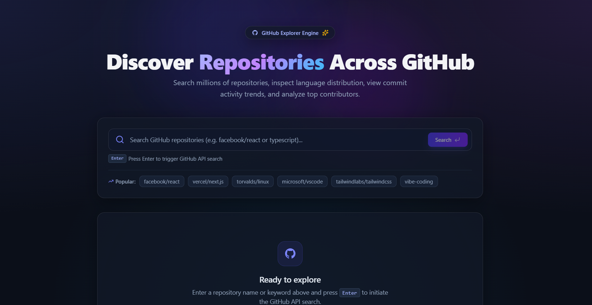
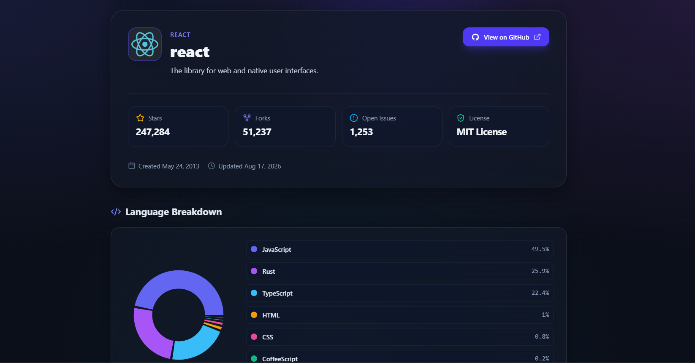

# GitHub Repository Explorer 🚀

A modern, responsive web application built with React, TypeScript, Vite, and TailwindCSS for searching and inspecting GitHub repositories. It provides detailed repository analytics, including programming language breakdowns, commit activity trends, and contributor lists.

---

## 📌 Project Overview

**GitHub Repository Explorer** is an interactive web dashboard designed to discover open-source projects across GitHub. With a sleek dark glassmorphism design, users can search repositories, filter by language, sort by stars/forks/activity, and drill down into rich statistics for any repository.

API calls to GitHub REST endpoints are intentionally triggered **only when the user submits a search** (pressing <kbd>Enter</kbd> or clicking Search) to avoid unnecessary API rate limiting while maintaining an ultra-responsive user experience.

---

## ✨ Features Implemented

- 🔍 **Trigger-on-Enter API Searching**: Inputting text only updates local UI state; network calls to the GitHub API are triggered solely when pressing `Enter` or clicking the Search button.
- ⚡ **Quick-Preset Suggestions**: 1-click popular repository suggestions (`facebook/react`, `vercel/next.js`, `torvalds/linux`, etc.).
- 🎨 **Modern Glassmorphism UI**: Dark mode aesthetic with background glows, custom scrollbars, and smooth micro-animations.
- 📊 **Interactive Analytics Charts**:
  - **Language Breakdown**: Donut chart representing programming language distribution.
  - **Commit Activity Timeline**: Interactive bar chart displaying commit activity trends over recent weeks.
- 👥 **Top Contributors List**: Displays contributor avatars, commit counts, and special rank badges for top contributors.
- 🎛️ **Filtering & Sorting**: Filter search results by language and sort by Most Stars, Most Forks, Best Match, or Recently Updated.
- 📱 **Fully Responsive Layout**: Mobile-first design system optimized for smartphones, tablets, and desktop displays.

---

## 🛠️ Technologies and Libraries Used

- **Frontend Core**: React 19, TypeScript
- **Build Tool & Dev Server**: Vite 8
- **Styling**: TailwindCSS 4, Custom CSS Glassmorphism Engine
- **Data Fetching & Caching**: TanStack React Query 5
- **Routing**: React Router DOM 7
- **Data Visualization**: Recharts 3
- **Icons**: Lucide React
- **Code Linting**: Oxlint

---

## 🚀 Setup Instructions

> This project is designed for web deployment and can be accessed directly via the deployed link below.

---

## 📁 Project Structure

```text
github-explorer/
├── public/
├── src/
│   ├── assets/          # Static assets
│   ├── components/      # Reusable UI components
│   │   ├── CommitChart.tsx       # Recharts bar chart for weekly commit activity
│   │   ├── ContributorList.tsx   # Contributor list with avatar badges
│   │   ├── LanguageChart.tsx     # Recharts pie chart for language distribution
│   │   ├── RepositoryCard.tsx    # Glassmorphism repository summary card
│   │   └── SearchBar.tsx         # Search bar component with Enter trigger
│   ├── hooks/           # Custom React hooks
│   ├── pages/           # Application pages & routes
│   │   ├── HomePage.tsx          # Main search & repository explorer page
│   │   └── RepositoryPage.tsx    # Comprehensive repository dashboard
│   ├── services/        # GitHub REST API client logic
│   │   └── github.ts
│   ├── App.tsx          # Main routing & entry layout
│   ├── index.css        # Tailwind imports & dark glass design tokens
│   └── main.tsx         # Application entry point
├── index.html
├── package.json
├── tsconfig.json
└── vite.config.ts
```

---

## 📁 Screenshots

### Home Page



### Repository Dashboard



---

## 🌐 Deployment Link

<!-- Add your live deployment URL below once deployed -->
[Live Deployment Link](https://github-explorer-omega-snowy.vercel.app/)
